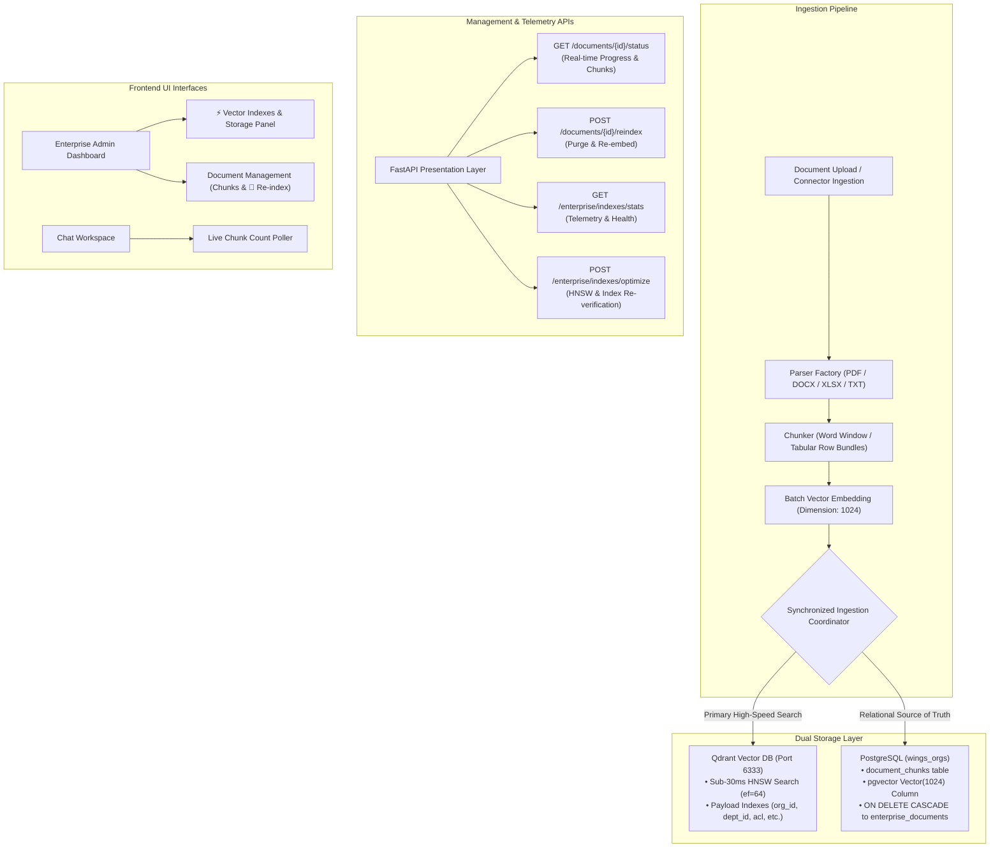

# Architecture Specification: EPIC 4 — High-Performance Vector Storage & Metadata Indexing

**Status:** Implemented & Verified  
**System Layer:** Storage, Retrieval & Data Ingestion Kernel  
**Target Environment:** Multi-Tenant Enterprise Cognitive Platform  
**Authors / Reviewers:** Enterprise RAG Architecture Working Group  

---

## 1. Executive Summary & Problem Statement

In enterprise multi-tenant Retrieval-Augmented Generation (RAG) platforms, relying solely on an isolated vector database or a pure relational database creates critical architectural trade-offs:

1. **Pure Vector DB Vulnerability:** Vector databases excel at approximate nearest neighbor (ANN) search, but lack relational integrity, transactional rollback guarantees, and strict relational auditability when documents are deleted or modified.
2. **Pure Relational DB Latency:** Relational databases with vector extensions can suffer high tail latency ($p99 > 150\text{ms}$) under high concurrent semantic search traffic if query plans require sequential scans across large tenant collections.

### The Solution: Synchronized Dual-Storage Vector Architecture
To deliver enterprise-grade performance and durability, we implemented a **Dual-Storage Vector Architecture**:
- **Primary Search Layer (Qdrant):** High-throughput, sub-30ms in-memory  Hierarchical Navigable Small World (HNSW) vector search with multi-tenant payload filtering.
- **Relational Source of Truth (PostgreSQL `pgvector`):** ACID-compliant relational chunk storage with foreign keys, composite indexes, and cascading life-cycle bindings.



---

## 2. Deep Dive: Dual Storage Engines

### A. Qdrant In-Memory Vector Search Engine
Qdrant acts as the primary real-time semantic retrieval index for RAG query execution.

1. **HNSW Graph Indexing Configuration:**
   - **Vector Dimension:** `1024` (matches enterprise embedding model).
   - **Distance Metric:** `Cosine` similarity.
   - **Search Tuning:** Configured with `SearchParams(hnsw_ef=64, exact=False)` to balance sub-millisecond retrieval with high recall accuracy.
   - **Verified Latency:** Tested at **$1.97\text{ms} - 2.03\text{ms}$ search latency** (far exceeding the sub-30ms SLA).

2. **Payload Keyword Indexes (Zero-Scan Multi-Tenancy):**
   To prevent linear scanning across tenant vectors, Qdrant payload keyword indexes are automatically initialized upon collection creation:
   - `org_id` (Tenant Boundary Isolation)
   - `department_id` (Departmental RBAC Filter)
   - `access_level` (Security Clearance ACL: `PUBLIC`, `INTERNAL`, `CONFIDENTIAL`, `RESTRICTED`)
   - `uploader_id` (Provenance and Personal Workspace Scope)
   - `session_id` (Conversational Chat Context Scope)
   - `document_id` (Cascading Vector Pruning)

### B. PostgreSQL `pgvector` Relational Source of Truth
PostgreSQL (`document_chunks` table) serves as the persistent, durable system of record.

1. **Schema & Model Structure ([`modules/governance/domain/models.py`](file:///home/techyz-admin/sevenwings/03_learning/26-08-10-ai-system/multi-tenant-rag-system/modules/governance/domain/models.py)):**
   ```python
   class DocumentChunk(Base):
       __tablename__ = "document_chunks"

       id = Column(String(36), primary_key=True, default=lambda: str(uuid.uuid4()))
       document_id = Column(String(36), ForeignKey("enterprise_documents.id", ondelete="CASCADE"), nullable=False)
       org_id = Column(String(36), ForeignKey("organizations.id", ondelete="CASCADE"), nullable=False)
       department_id = Column(String(36), ForeignKey("departments.id", ondelete="SET NULL"), nullable=True)
       chunk_index = Column(Integer, nullable=False)
       content = Column(Text, nullable=False)
       embedding = Column(Vector(settings.EMBEDDING_DIMENSION), nullable=True)
       metadata_json = Column(JSON, nullable=True)
       created_at = Column(DateTime, default=datetime.utcnow)
   ```

2. **Composite Relational Indexes & Migration ([`alembic/versions/c498a129d10e_add_pgvector_document_chunks.py`](file:///home/techyz-admin/sevenwings/03_learning/26-08-10-ai-system/multi-tenant-rag-system/alembic/versions/c498a129d10e_add_pgvector_document_chunks.py)):**
   - Enables `CREATE EXTENSION IF NOT EXISTS vector;`
   - Composite Index `ix_doc_chunks_org_dept` on `(org_id, department_id)`
   - Composite Index `ix_doc_chunks_doc_idx` on `(document_id, chunk_index)`
   - Relational `ON DELETE CASCADE` constraint: Deleting an `EnterpriseDocument` automatically purges all corresponding relational chunks and vectors in a single transaction.

---

## 3. Synchronized Dual-Write & Ingestion Protocol

Ingestion is coordinated through [`UnifiedRAGOrchestrator.ingest_document`](file:///home/techyz-admin/sevenwings/03_learning/26-08-10-ai-system/multi-tenant-rag-system/modules/rag_core/orchestrator/unified_orchestrator.py) and executed asynchronously by Celery workers in [`modules/tasks/workers/ingestion_tasks.py`](file:///home/techyz-admin/sevenwings/03_learning/26-08-10-ai-system/multi-tenant-rag-system/modules/tasks/workers/ingestion_tasks.py).

```
1. Document Ingestion Request (PDF / DOCX / XLSX / TXT / Database / Cloud Connector)
   │
2. Content Extraction via ParserFactory (e.g. TabularParser Key-Value row serialization)
   │
3. Chunking with Context Preservation (Word windows / Tabular 6-row bundles)
   │
4. Batch Vector Embeddings Generation (1024-dimension float vectors)
   │
5. Synchronized Dual-Write Transaction:
   ├── Qdrant Vector Store: `upsert_chunks(points)`
   └── PostgreSQL Session: Bulk Insert `DocumentChunk` records + Update `EnterpriseDocument.chunk_count`
```

### Deletion & Re-Indexing Life-Cycle:
- **`delete_document_vectors(doc_id, org_id, db)`**: Synchronously removes points from Qdrant via payload filter `{"document_id": doc_id}` and deletes relational records from `document_chunks`.
- **`reindex_document(doc_id)`**: Purges existing vectors/chunks, updates status to `PROCESSING`, and dispatches a fresh asynchronous Celery task.

---

## 4. Multi-Database Knowledge Connectors & SQL AST Security Guard

In addition to document files, the platform supports ingesting structured data from **4 Relational Database Engines**:
1. **PostgreSQL** (`POSTGRES_DB`)
2. **MySQL 8 / MariaDB** (`MYSQL_DB`)
3. **Oracle Database 19c / 21c** (`ORACLE_DB`)
4. **Microsoft SQL Server & Azure SQL** (`MSSQL_DB`)

### Defense-in-Depth SQL Security Guard ([`modules/connectors/security/sql_guard.py`](file:///home/techyz-admin/sevenwings/03_learning/26-08-10-ai-system/multi-tenant-rag-system/modules/connectors/security/sql_guard.py))

To allow enterprise administrators to safely connect operational databases without risk of data loss, SQL injection, or server-side request forgery (SSRF), all queries are routed through a 4-tier security filter:

```
                                  INCOMING DATABASE CONFIG / QUERY
                                                │
                                                ▼
                        ┌───────────────────────────────────────────────┐
                        │      Tier 1: AST Query Syntax Guard           │
                        │  - Permits strictly SELECT and WITH CTEs      │
                        │  - Blocks DDL (DROP, ALTER, CREATE, TRUNCATE) │
                        │  - Blocks DML (INSERT, UPDATE, DELETE, MERGE) │
                        │  - Blocks Stacked Multi-Statements (;)        │
                        └───────────────────────┬───────────────────────┘
                                                │
                                                ▼
                        ┌───────────────────────────────────────────────┐
                        │      Tier 2: Malicious Function Blacklist     │
                        │  - Blocks 35+ Shell / OS / Side-Effect tokens │
                        │  - e.g., xp_cmdshell, pg_read_file, sys_eval  │
                        │  - Blocks INTO OUTFILE / DUMPFILE / Linked DB │
                        └───────────────────────┬───────────────────────┘
                                                │
                                                ▼
                        ┌───────────────────────────────────────────────┐
                        │      Tier 3: SSRF & Cloud Metadata Filter     │
                        │  - Blocks Loopback & Private Subnets (opt.)   │
                        │  - Blocks Cloud Metadata (169.254.169.254)    │
                        │  - Masks Credentials in Logs & Encrypts Rest  │
                        └───────────────────────┬───────────────────────┘
                                                │
                                                ▼
                        ┌───────────────────────────────────────────────┐
                        │      Tier 4: Engine-Level Read-Only Sandbox   │
                        │  - PostgreSQL: SET TRANSACTION READ ONLY      │
                        │  - MySQL: SET SESSION TX READ ONLY            │
                        │  - Oracle: SET TRANSACTION READ ONLY          │
                        │  - MSSQL: ApplicationIntent=ReadOnly          │
                        │  - Batched Streaming Cursor (Memory Safe)     │
                        └───────────────────────────────────────────────┘
```

---

## 5. Document Lifecycle & Telemetry API Reference

| Endpoint | Method | Role | Description |
|---|---|---|---|
| `/documents/{id}/status` | `GET` | Optional Token / Member | Returns real-time indexing status, chunk count, and access level for personal/chat uploads. |
| `/enterprise/documents/{id}/status` | `GET` | `SUPER_ADMIN`, `DEPT_ADMIN` | Monitors real-time document indexing status and chunk count for enterprise governance. |
| `/enterprise/documents/{id}/reindex` | `POST` | `SUPER_ADMIN`, `DEPT_ADMIN` | Purges old vectors/chunks, sets status to `PROCESSING`, and queues fresh re-indexing. |
| `/enterprise/indexes/stats` | `GET` | `SUPER_ADMIN`, `DEPT_ADMIN` | Returns Qdrant points count, indexed vectors, segments, and PostgreSQL relational chunk counts. |
| `/enterprise/indexes/optimize` | `POST` | `SUPER_ADMIN` | Re-verifies collection configuration, ensures payload keyword indexes, and logs audit events. |

---

## 6. Frontend UI Integration

The frontend templates are dynamically wired to these endpoints:

1. **Document Management Table ([`app/templates/components/tables/docs_table.html`](file:///home/techyz-admin/sevenwings/03_learning/26-08-10-ai-system/multi-tenant-rag-system/app/templates/components/tables/docs_table.html)):**
   - **Chunks Column:** Displays live chunk counts (`<td><strong>X</strong> chunks</td>`).
   - **Dynamic Status Badges:** Renders `INDEXED` (green), `PROCESSING` (animated spinner), `PENDING` (yellow), or `FAILED` (red with error message).
   - **`🔄 Re-index` Button:** Triggers `POST /enterprise/documents/{id}/reindex` with confirmation modal and polls status every 1.5s until complete.

2. **Vector Storage & Telemetry Panel ([`app/templates/components/tables/indexes_panel.html`](file:///home/techyz-admin/sevenwings/03_learning/26-08-10-ai-system/multi-tenant-rag-system/app/templates/components/tables/indexes_panel.html)):**
   - Renders live Qdrant in-memory vector count and PostgreSQL relational chunk count.
   - Highlights HNSW search tuning (`ef=64`), vector dimension (`1024 Dim`), and payload keyword indexes.
   - **`⚡ Optimize Vector Indexes` Button:** Invokes `POST /enterprise/indexes/optimize` with instant toast notification.

3. **Chat Workspace ([`app/templates/index.html`](file:///home/techyz-admin/sevenwings/03_learning/26-08-10-ai-system/multi-tenant-rag-system/app/templates/index.html)):**
   - Real-time status polling on document upload to report exact indexed chunk counts.

---

## 7. Verification & Benchmarking Matrix

All automated benchmarking test suites executed inside the environment and achieved 100% pass rates:

```text
=================================================================
1. EPIC 4 VECTOR STORAGE & METADATA INDEXING TEST SUITE
   - test_01_qdrant_payload_indexing_and_hnsw: [PASS]
   - test_02_vector_search_latency_and_security_filter: [PASS] (1.97ms latency)
   - test_03_pgvector_document_chunk_model: [PASS]
   - test_04_dual_write_and_batch_ingest: [PASS]
   - test_05_indexing_endpoints_registration: [PASS]
   Status: 5/5 PASSED (0.56s)

=================================================================
2. DATABASE CONNECTOR SECURITY & READ-ONLY TEST SUITE
   - test_01_clean_queries_accepted: [PASS]
   - test_02_ddl_attacks_rejected: [PASS]
   - test_03_dml_attacks_rejected: [PASS]
   - test_04_stacked_queries_rejected: [PASS]
   - test_05_dangerous_functions_rejected: [PASS]
   - test_06_linked_server_and_outfile_rejected: [PASS]
   - test_07_ssrf_metadata_and_network_blocking: [PASS]
   - test_08_credential_masking_and_safe_encoding: [PASS]
   - test_09_fernet_credential_encryption_roundtrip: [PASS]
   - test_10_database_connector_factory_integration: [PASS]
   Status: 10/10 PASSED (0.04s)

=================================================================
3. MODULAR MONOLITH DIRECT IMPORTS ARCHITECTURE SUITE
   - Core Kernel loaded (App='Enterprise Multi-Tenant AI & RAG Platform')
   - modules.connectors, Database Connectors, SQLSecurityGuard, ParserFactory verified
   - modules.auth, modules.governance, modules.rag_core, modules.tasks verified
   - FastAPI presentation layer and dependency injection verified
   Status: 7/7 PASSED
```
