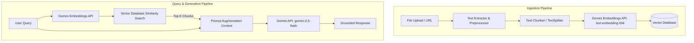

# Architectural Blueprint & Implementation Plan: RAG Integration & Modularization

This document outlines a modular architecture and step-by-step implementation blueprint to introduce a **Retrieval-Augmented Generation (RAG)** system into your existing FastAPI Gemini-powered application. 

Crucially, **no code has been modified**; this plan is strictly design-focused to allow you to structure and implement the changes at your own pace.

---

## 1. Analysis of Existing Codebase

Before introducing new architectural elements, here is an analysis of your current application structure and design patterns:

### Core Components
1. **Framework**: FastAPI serving HTML templates via `Jinja2Templates` and exposure of three JSON endpoints (`/generate/`, `/analyze/`, `/keywords/`).
2. **AI Integration (`app/utility.py`)**: Uses the legacy `google-generativeai` SDK calling `"gemini-2.5-flash"` for text generation, sentiment analysis, and keyword extraction.
3. **Concurrency**: Synchronous SDK calls are executed inside Starlette's threadpool (`run_in_threadpool`) with a client-side `threading.Semaphore(5)` to control maximum concurrency.
4. **Database & Persistence (`app/models.py`, `app/crud.py`, `app/database.py`)**:
   - Uses SQLAlchemy (synchronous engine).
   - Keeps track of search topics in a `SearchTerm` table, using a SHA-256 hash (`term_hash`) to quickly check for duplicates.
   - Relates generated text (`GeneratedContent`), SEO keywords (`GeneratedKeywords`), and readability/sentiment (`SentimentAnalysis`) directly to the parent `SearchTerm` ID.

### Key Refactoring Opportunities
* **Flat File Structure**: As the app grows (e.g., adding RAG routes, ingestion, vector retrieval), keeping everything under one flat directory (`app/`) will become difficult to navigate.
* **Legacy Google GenAI SDK**: The codebase currently uses `google-generativeai`. It is highly recommended to migrate to the new unified **Google GenAI SDK** (`google-genai` package), which utilizes the `from google import genai` import namespace.
* **Synchronous Bottlenecks**: High-throughput LLM applications benefit heavily from asynchronous runtimes. Migrating to an async database driver (e.g., `asyncpg` or `aiosqlite` with SQLAlchemy `create_async_engine`) and leveraging Gemini's async calls (`client.aio.models.generate_content`) would eliminate thread-pool execution overhead.

---

## 2. Proposed Modular Folder Structure

To scale this application gracefully, we propose separating concerns using a **Service-Repository** pattern. This structure cleanly isolates database operations (CRUD), third-party API clients (Services), API endpoint definitions (Routers), and request schemas.

```text
app/
│
├── core/                  # Core configuration files
│   ├── config.py          # Setting validations (using Pydantic BaseSettings)
│   └── database.py        # SessionLocal, Base, engine declaration
│
├── models/                # SQLAlchemy database models
│   ├── __init__.py        # Export all models for Alembic auto-discovery
│   ├── content.py         # Existing models: SearchTerm, GeneratedContent, etc.
│   └── rag.py             # New models: Document, IngestionMetadata, RAGConversation
│
├── schemas/               # Pydantic schemas (Data serialization & validation)
│   ├── __init__.py
│   ├── content.py         # Existing schemas (GeneratePayload, AnalyzePayload, etc.)
│   └── rag.py             # New schemas (DocUploadResponse, RAGQuery, RAGResponse)
│
├── crud/                  # Database repository layer (Pure DB Queries)
│   ├── __init__.py
│   ├── content.py         # Existing CRUD operations (create_search_term, etc.)
│   └── rag.py             # New RAG CRUD operations (register_document, save_chat_history)
│
├── services/              # Third-party integrations & core business logic
│   ├── __init__.py
│   ├── gemini.py          # Gemini API wrapper (Embeddings, Chat, Text Gen)
│   └── rag.py             # Core RAG Orchestrator (Chunking, Vector DB interface)
│
├── routers/               # FastAPI route definitions (Endpoints)
│   ├── __init__.py
│   ├── content.py         # Refactored routes for content generation & SEO
│   ├── rag.py             # New RAG endpoints (document ingestion and retrieval)
│   └── views.py           # Endpoint for serving HTML pages
│
├── templates/             # Jinja2 Templates (index.html, rag.html, etc.)
│   └── index.html
│
└── main.py                # FastAPI app initialization, middleware, and router inclusion
```

---

## 3. RAG Architecture Design

A Retrieval-Augmented Generation system requires two main pipelines: **Ingestion** and **Query & Generation**.



### Key Technical Choices

#### 1. Vector Database Selection
Depending on your deployment environment, you can choose one of the following:
* **Option A: pgvector (Recommended if migrating to PostgreSQL)**
  * *Why*: Keeps your stack simple by storing vectors inside your relational database. Allows queries using SQL, maintaining ACID compliance.
  * *How*: Enable the `pgvector` extension in Postgres and use SQLAlchemy or direct SQL queries for Cosine Similarity.
* **Option B: ChromaDB / FAISS (Recommended for local/lightweight setups)**
  * *Why*: Chroma is an embedded database that runs in-process. It is very simple to integrate locally and doesn't require setting up external database servers.
* **Option C: Google Gemini Managed Semantic Retriever**
  * *Why*: Google GenAI SDK offers a built-in semantic retriever (AQA model and files API corpus). It requires no external vector database and is fully managed.

#### 2. Embedding Model
* **Model**: `text-embedding-004` (via Gemini API).
* **Dimensions**: 768 dimensions. High-performance, semantic representations optimized for English and multilingual texts.

---

## 4. Database Models & Schema Extensions

To support document tracking, document chunks metadata, and chat memory, the following SQLAlchemy models should be introduced:

```python
# app/models/rag.py
from sqlalchemy import Column, Integer, String, Text, ForeignKey, DateTime
from sqlalchemy.orm import relationship
from datetime import datetime
from app.core.database import Base

class Document(Base):
    __tablename__ = "documents"

    id = Column(Integer, primary_key=True, index=True)
    filename = Column(String(255), nullable=False)
    file_type = Column(String(50))
    upload_date = Column(DateTime, default=datetime.utcnow)
    checksum = Column(String(64), unique=True, index=True)  # MD5/SHA256 to prevent duplicate file indexing
    status = Column(String(50), default="pending")  # pending, processing, indexed, error
    
    # Relationship to track individual chunks
    chunks = relationship("DocumentChunk", back_populates="document", cascade="all, delete-orphan")

class DocumentChunk(Base):
    __tablename__ = "document_chunks"

    id = Column(Integer, primary_key=True, index=True)
    document_id = Column(Integer, ForeignKey("documents.id", ondelete="CASCADE"), nullable=False)
    chunk_index = Column(Integer, nullable=False)
    content = Column(Text, nullable=False)
    vector_id = Column(String(100), index=True)  # References the ID inside the external Vector DB (e.g. Chroma/Pinecone)

    document = relationship("Document", back_populates="chunks")
```

---

## 5. RAG Endpoints Blueprint

To cleanly integrate RAG without polluting your existing content endpoints, you should define a new router (`app/routers/rag.py`). Here is the recommended routing plan:

### 1. Document Ingestion
* **Endpoint**: `POST /rag/ingest`
* **Content-Type**: `multipart/form-data`
* **Description**: Accepts document files (PDF, TXT, MD, etc.), checks if the file hash already exists, reads the content, splits it into chunks, generates embeddings, stores the vectors in the Vector DB, and registers metadata in the SQL database.
* **Payload**: `UploadFile`

### 2. Semantic Query
* **Endpoint**: `POST /rag/query`
* **Content-Type**: `application/json`
* **Description**: Takes a user query, embeds it, retrieves the top-K chunks from the Vector DB, builds an augmented context, feeds it to `gemini-2.5-flash`, and returns the grounded answer alongside the source reference documents.
* **Payload**:
  ```json
  {
    "query": "What are our guidelines for SEO optimization?",
    "top_k": 3,
    "temperature": 0.2
  }
  ```
* **Response**:
  ```json
  {
    "answer": "...",
    "sources": [
      {
        "filename": "seo_guidelines.pdf",
        "chunk_index": 2,
        "content_preview": "..."
      }
    ]
  }
  ```

### 3. Ingested Documents List
* **Endpoint**: `GET /rag/documents`
* **Description**: Lists all files that have been successfully parsed and indexed in the system.
* **Response**: A list of document metadata objects.

---

## 6. Service Layer Design Patterns

To maintain modularity, keep the routing layer purely focused on HTTP requests/responses, and delegate AI and RAG operations to dedicated service classes.

### The Gemini Client Service (`app/services/gemini.py`)
```python
import os
from google import genai
from google.genai import types

class GeminiService:
    def __init__(self):
        # Initializing the new Unified Google GenAI client
        self.client = genai.Client(api_key=os.getenv("GEMINI_API_KEY"))
        self.default_model = "gemini-2.5-flash"
        self.embedding_model = "text-embedding-004"

    def generate_response(self, prompt: str, system_instruction: str = None) -> str:
        config = types.GenerateContentConfig(
            system_instruction=system_instruction,
            temperature=0.2
        )
        response = self.client.models.generate_content(
            model=self.default_model,
            contents=prompt,
            config=config
        )
        return response.text.strip()

    def get_embeddings(self, text: str) -> list[float]:
        response = self.client.models.embed_content(
            model=self.embedding_model,
            contents=text
        )
        # Extract embedding vector list
        return response.embeddings[0].values
```

### The RAG Orchestrator Service (`app/services/rag.py`)
This service acts as the glue code between the Vector Store, text chunking, and Gemini.

```python
from app.services.gemini import GeminiService

class RAGService:
    def __init__(self, gemini_service: GeminiService, vector_db_client):
        self.gemini = gemini_service
        self.vector_db = vector_db_client

    def process_and_index_file(self, filename: str, content: str, doc_id: int):
        # 1. Split content into logical chunks (e.g. 500 characters with 50 character overlap)
        chunks = self._chunk_text(content, chunk_size=500, overlap=50)
        
        # 2. Batch generate embeddings and upload to vector database
        for index, chunk in enumerate(chunks):
            embedding = self.gemini.get_embeddings(chunk)
            vector_id = f"doc_{doc_id}_chunk_{index}"
            
            # Store in Vector DB along with metadata
            self.vector_db.upsert(
                id=vector_id,
                vector=embedding,
                metadata={"document_id": doc_id, "filename": filename, "text": chunk}
            )
            
            # Save mapping references in the SQL database for relationship queries
            # (Triggered via CRUD modules)

    def query_with_context(self, user_query: str, top_k: int = 3) -> tuple[str, list]:
        # 1. Embed query
        query_embedding = self.gemini.get_embeddings(user_query)
        
        # 2. Similarity search in vector DB
        results = self.vector_db.search(query_embedding, limit=top_k)
        
        # 3. Compile context from search results
        context_blocks = []
        sources = []
        for match in results:
            context_blocks.append(match.metadata["text"])
            sources.append({
                "filename": match.metadata["filename"],
                "text": match.metadata["text"][:100] + "..."
            })
            
        context_str = "\n\n---\n\n".join(context_blocks)
        
        # 4. Formulate prompt
        system_instruction = (
            "You are a knowledge retrieval assistant. Answer the user query using ONLY "
            "the provided retrieved context block. If the answer cannot be found in the "
            "context, state that you do not have sufficient information."
        )
        prompt = f"Retrieved Context:\n{context_str}\n\nUser Query: {user_query}"
        
        # 5. Generate Answer
        answer = self.gemini.generate_response(prompt, system_instruction=system_instruction)
        return answer, sources

    def _chunk_text(self, text: str, chunk_size: int, overlap: int) -> list[str]:
        # Implementation of sliding-window character text splitter
        chunks = []
        start = 0
        while start < len(text):
            end = start + chunk_size
            chunks.append(text[start:end])
            start += chunk_size - overlap
        return chunks
```

---

## 7. Migration & Step-by-Step Implementation Roadmap

If you decide to execute this architectural layout, we recommend doing so in phased, incremental steps to keep your API fully functional at each stage:

### Phase 1: Modularize the Current Application (No feature changes)
1. **Re-structure Folders**: Create `core/`, `models/`, `schemas/`, `crud/`, `services/`, and `routers/` directories.
2. **Move Core Modules**:
   * Move DB initialization and engines to `app/core/database.py`.
   * Move Pydantic structures to `app/schemas/content.py`.
   * Move models to `app/models/content.py`.
   * Move database CRUD methods to `app/crud/content.py`.
   * Move AI wrappers to `app/services/gemini.py`.
3. **Set Up APIRouter**: Break down routes in `app/main.py` into `app/routers/content.py` and `app/routers/views.py`. Include them in `main.py` using `app.include_router()`.
4. **Test & Verify**: Run the server to ensure existing functionality remains perfectly intact.

### Phase 2: Upgrade Gemini Integration
1. Install `google-genai` and migrate `GeminiService` in `app/services/gemini.py` to use the new `genai.Client` class as shown in the blueprints.
2. Replace old `google.generativeai` configuration logic in utility functions.

### Phase 3: Setup Vector DB & Database Models
1. Add RAG-related models (`Document`, `DocumentChunk`) into `app/models/rag.py` and schemas to `app/schemas/rag.py`.
2. Generate an alembic migration script (`alembic revision --autogenerate`) to create the new tables.
3. Install vector DB client packages (`chromadb` or setup `pgvector` extension in database).

### Phase 4: Implement Ingestion & Query Logic
1. Add RAG processing service logic in `app/services/rag.py`.
2. Set up RAG endpoint routes in `app/routers/rag.py` for `/rag/ingest` and `/rag/query`.
3. Expose the router in `app/main.py`.

### Phase 5: UI & Integration Testing
1. Update your index or build a new HTML page under `app/templates` to support document uploads and vector-search queries.
2. Run end-to-end user tests validating correct grounding and context retrieval.
