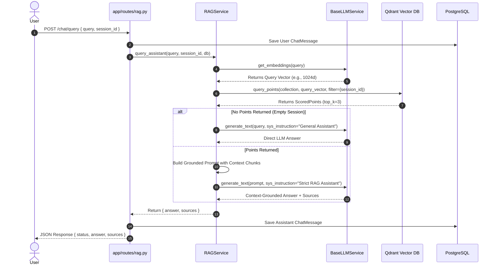
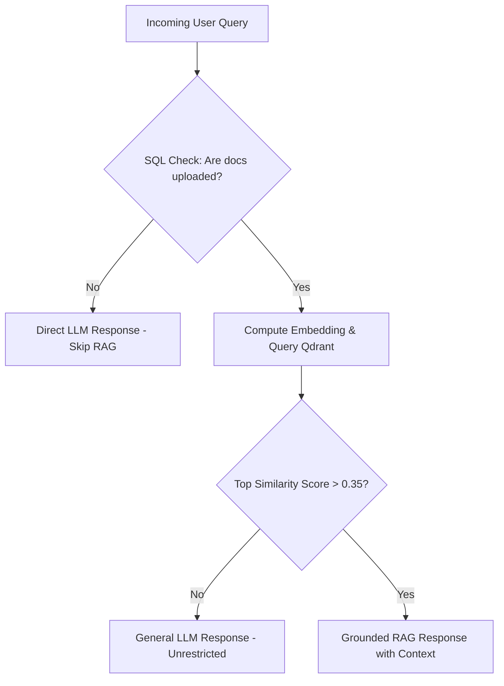

# RAG System Architecture & Scaling Roadmap

## Executive Summary
This document provides a comprehensive overview of the current Retrieval-Augmented Generation (RAG) system architecture, query execution flow, identified performance bottlenecks, and a strategic scaling roadmap for enterprise evolution.

---

## 1. Current System Architecture & Query Flow

### Component Breakdown

1. **Relational Database (PostgreSQL)**:
   * Stores chat session metadata (`chat_sessions`), conversational memory (`chat_messages`), and uploaded document registries (`chat_documents`).
   * Configured with `ON DELETE CASCADE` relationships to clean up child records when a session is purged.

2. **Vector Database (Qdrant)**:
   * Collection `assistant_knowledge` stores document chunks as dense vector embeddings alongside payload metadata (`session_id`, `filename`, `chunk_index`, `content`).
   * Configured with dynamic dimension matching (auto-detects 1024d vs 768d depending on the active embedding provider).

3. **Inference & Embedding Layer (`BaseLLMService`)**:
   * Uses the **Provider/Strategy Pattern** supporting Google Gemini, Ollama (`gemma3:12b` + `qwen3-embedding:0.6b`), vLLM, and OpenAI endpoints.

---

### Sequence Diagram & Query Execution Flow

---

## 2. Current Bottlenecks & Limitations

### 1. Unnecessary Embedding & Vector Overhead
* **Issue**: `query_assistant()` executes `self.llm.get_embeddings(query)` and a Qdrant search for **every incoming message**, even if the user has not uploaded any documents to that chat session.
* **Impact**: Unnecessary latency (100ms–400ms overhead per message) and redundant API calls.

### 2. General Knowledge Refusal in Active RAG Sessions
* **Issue**: When a chat session has uploaded documents, Qdrant will return the top 3 nearest vector chunks regardless of how low the semantic relevance score is.
* **Impact**: The strict grounding system prompt (`"Answer using ONLY the provided Context block..."`) forces the LLM to refuse general questions (e.g., *"What is the capital of France?"*) with *"I don't know based on the uploaded documents."*

### 3. Synchronous HTTP Document Ingestion
* **Issue**: File parsing (`PdfReader`), text chunking, embedding generation, and Qdrant indexing happen synchronously inside the FastAPI HTTP handler thread (`POST /chat/upload`).
* **Impact**: Large PDFs (>10 MB or 50+ pages) cause HTTP request timeouts and block server throughput.

### 4. Dense-Only Vector Retrieval
* **Issue**: Semantic vector search struggles with exact keyword matching (e.g., product SKUs, exact dates, names, or code syntax).
* **Impact**: Reduced retrieval precision for domain-specific technical documents.

---

## 3. Scalability & Future Improvements

To transform this system into a multi-tenant, enterprise RAG platform, we recommend implementing the following architectural patterns:

### A. Smart Query Routing & Optimization

1. **Fast SQL Pre-Check**: Check `chat_documents` count in PostgreSQL before calling embedding APIs or Qdrant.
2. **Relevance Thresholding**: Evaluate Qdrant `point.score`. If `score < 0.35`, ignore context and generate an unconstrained answer.

---

### B. Asynchronous Background Ingestion Queue
* Offload document parsing, chunking, and embedding to background worker processes using **Redis + Celery** or **ARQ**.
* Upload API immediately returns `202 Accepted` with a `task_id`, keeping HTTP response times under 50ms.

---

### C. Hybrid Retrieval & Re-ranking Pipeline
* **Hybrid Search**: Combine Qdrant Dense Vector Search (semantic similarity) with BM25 / Sparse Vector Search (exact keyword match).
* **Cross-Encoder Re-ranking**: Retrieve `top_k=25` candidate chunks from Qdrant, then run a Cross-Encoder Re-ranker (e.g., Cohere Rerank or BGE-Reranker) to select the `top_k=3` most accurate context chunks before passing to the LLM.

---

### D. Multi-Format & Multi-Source Connector Architecture
Implement abstract `BaseDataConnector` and `BaseParser` factories to seamlessly ingest data from:
* **Relational DBs**: PostgreSQL, MySQL dumps
* **Object Storage**: AWS S3, Google Cloud Storage
* **File Formats**: PDF, DOCX, Markdown, CSV, Audio Transcriptions (Whisper)

---

## 4. Implementation Roadmap

| Phase | Feature | Complexity | Latency Impact | Target Milestone |
| :--- | :--- | :--- | :--- | :--- |
| **Phase 1** | Fast SQL Pre-Check & Score Thresholding | Low | ⚡ **-300ms** for non-doc queries | `v1.1-query-optimization` |
| **Phase 2** | Asynchronous Background Ingestion (Redis/Celery) | Medium | ⚡ **Instant HTTP uploads** | `v1.2-async-ingestion` |
| **Phase 3** | Hybrid Search (Dense + Sparse/BM25) | Medium | 🎯 **+25% Retrieval Accuracy** | `v2.0-hybrid-retrieval` |
| **Phase 4** | Cross-Encoder Re-ranking Pipeline | Medium | 🎯 **Higher Precision Context** | `v2.1-reranking-engine` |
| **Phase 5** | Multi-Source Connectors (S3, DBs, Audio) | High | 🚀 **Enterprise Data Scale** | `v3.0-enterprise-connectors` |
